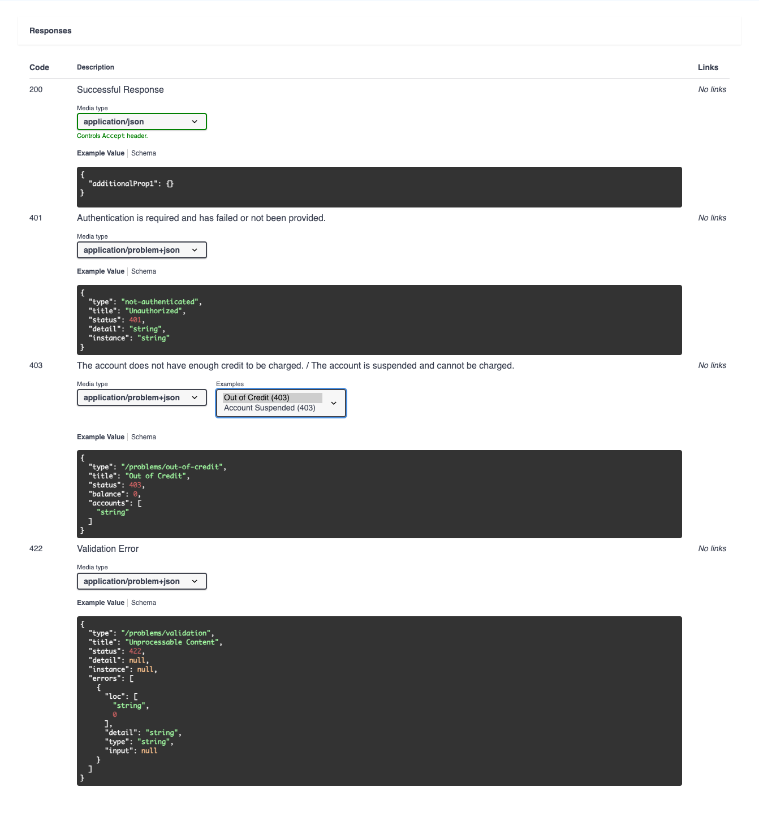
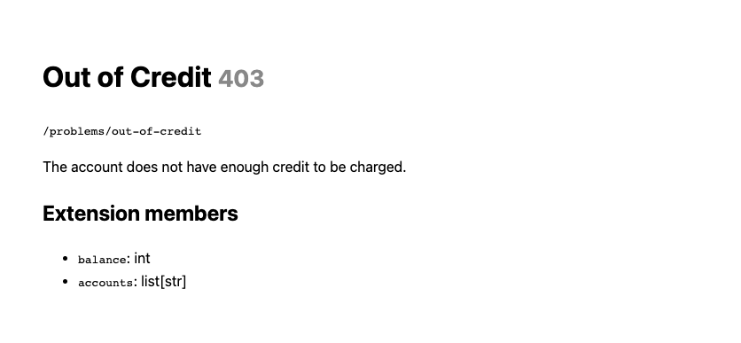

# fastapi-rfc9457

Typed, batteries-included [RFC 9457](https://www.rfc-editor.org/rfc/rfc9457.html)
"Problem Details for HTTP APIs" for FastAPI & Pydantic.

Define an error once - it serializes as `application/problem+json`, documents
itself in OpenAPI, and parses back into a typed exception on the client.

```python
from fastapi import FastAPI
from fastapi_rfc9457 import Problem, add_problem_handlers, get_problem_docs_router, problems


class OutOfCredit(Problem):
    """The account does not have enough credit."""
    type = "/problems/out-of-credit"
    title = "Out of Credit"
    status = 403
    balance: int            # typed extension members, checked at the raise site
    accounts: list[str]


class AccountSuspended(Problem):
    """The account is suspended and cannot be charged."""
    type = "/problems/account-suspended"
    title = "Account Suspended"
    status = 403


app = FastAPI()
add_problem_handlers(app)                                          # handlers + problem+json OpenAPI
app.include_router(get_problem_docs_router(), prefix="/problems")  # dereferenceable type URIs


@app.get("/charge", responses=problems(OutOfCredit, AccountSuspended))
async def charge() -> dict:
    raise OutOfCredit(detail="Not enough credit.", balance=30, accounts=["/acct/12"])
```

## Accurate OpenAPI, for free

One route can declare several failure modes. Distinct statuses get their own
response; same-status problems become a `oneOf` union you flip through in
Swagger's **Examples** dropdown — all under `application/problem+json`.



## Dereferenceable `type` URIs

Mount the docs router and every problem `type` resolves to a live page listing
its typed extension members.



## Features

- **Typed + validated extension members** that round-trip through serialization, OpenAPI, and the client.
- **Accurate per-route OpenAPI** under `application/problem+json`.
- **Structured 422** that preserves field + list-index mapping (no flattening).
- **Client-side parsing** back into typed problems.

## Install

```bash
uv add fastapi-rfc9457          # add fastapi-rfc9457[client] for the httpx hook
```

## Example

```bash
cd example && uv run uvicorn main:app --reload   # then open localhost:8000/docs
```

See [`example/`](./example) for the full runnable app, and
[`example/client.py`](./example/client.py) for the httpx hook (`fastapi-rfc9457[client]`)
that raises those problems back as typed exceptions on the consumer side.

## Notes

- Replaces FastAPI's default 422 body with `application/problem+json`.

